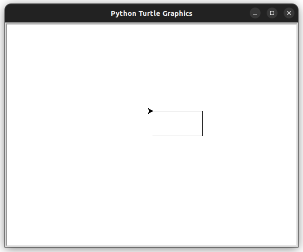
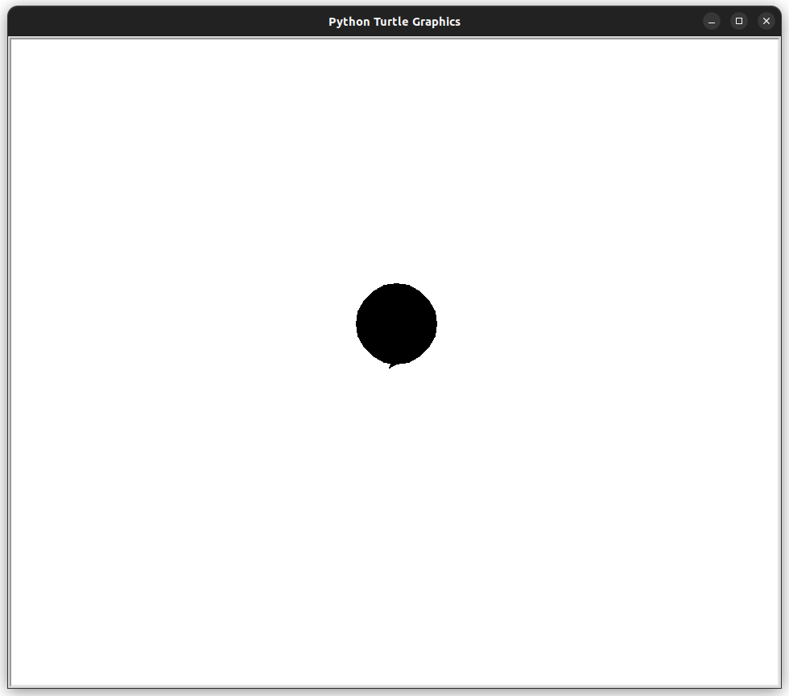
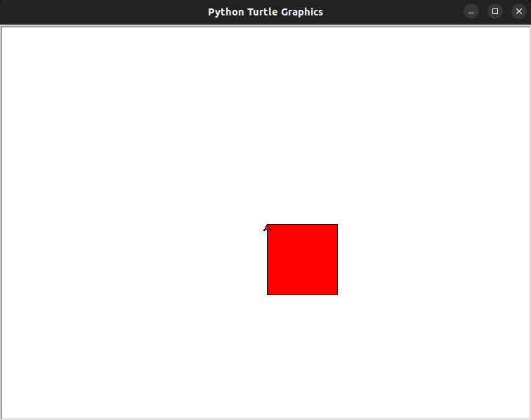

# Introdução

## O que é o pacote turtle

O pacote turtle é uma biblioteca gráfica do Python que permite criar desenhos e animações usando uma "tartaruga" virtual. A tartaruga pode ser movida e girada para criar linhas e formas. Ela também pode ser usada para preencher formas com cores.

## Movendo o turtle

Para mover a tartaruga, você pode usar os seguintes métodos:

- `forward(distância)`: move a tartaruga para frente a uma distância especificada.
- `backward(distância)`: move a tartaruga para trás a uma distância especificada.
- `left(ângulo)`: gira a tartaruga para a esquerda em um ângulo especificado.
- `right(ângulo)`: gira a tartaruga para a direita em um ângulo especificado.

### Exemplos

``` python
import turtle
# Cria uma nova janela do Turtle
janela = turtle.Screen()

# Cria uma nova turtle
cursor = turtle.Turtle()

# Move a turtle para frente 100 pixels
cursor.forward(100)
# Gira a turtle para a esquerda 90 graus
cursor.left(90)
# Move a turtle para trás 100 pixels
cursor.forward(50)
# Gira a turtle para a direita 90 graus
cursor.right(90)
# Move a turtle para frente 100 pixels
cursor.backward(100)

janela.mainloop()
```



## Desenhando formatos

Para desenhar formas, você pode usar os seguintes métodos:

- `begin_fill()`: inicia o preenchimento de uma forma.
- `end_fill()`: termina o preenchimento de uma forma.
- `circle(raio)`: desenha um círculo com o raio especificado.
- `dot(tamanho)`: desenha um ponto com o tamanho especificado.
- `line(x1, y1, x2, y2)`: desenha uma linha do ponto (x1, y1) ao ponto (x2, y2).

## Exemplos - círculo preenchido

``` python
# Cria uma nova janela do Turtle
janela = turtle.Screen()

# Cria uma nova turtle
cursor = turtle.Turtle()

# Inicia o preenchimento de uma forma
cursor.begin_fill()

# Desenha um círculo com raio de 50 pixels
cursor.circle(50)

# Termina o preenchimento da forma
cursor.end_fill()

janela.mainloop()
```



## Formatos pré-definidos

O pacote turtle também fornece uma série de formas pré-definidas, que podem ser desenhadas usando o método `shape()`. As formas pré-definidas incluem:

- `arrow`
- `circle`
- `square`
- `triangle`
- `turtle`

## Exemplos

``` python
# Define a forma da tartaruga como uma seta
tartaruga.shape("arrow")

# Define a forma da tartaruga como um círculo
tartaruga.shape("circle")

# Define a forma da tartaruga como um quadrado
tartaruga.shape("square")

# Define a forma da tartaruga como um triângulo
tartaruga.shape("triangle")

# Define a forma da tartaruga como uma tartaruga
tartaruga.shape("turtle")
```

## Preenchimentos

O pacote turtle também permite preencher formas com cores. Para preencher uma forma, você pode usar o método `fillcolor()`. O método `fillcolor()` recebe uma cor como argumento. A cor pode ser especificada usando um nome de cor, como "red", "green" ou "blue", ou usando um código hexadecimal, como "#ff0000" (vermelho).

``` python
# Define a cor de preenchimento da tartaruga como vermelho
tartaruga.fillcolor("red")
# Define a cor de preenchimento da tartaruga usando um código hexadecimal
tartaruga.fillcolor("#ff0000")
```

## Exemplo

O seguinte código desenha um quadrado com o lado de 100 pixels e o preenche com a cor vermelha:

``` python
import turtle

# Cria uma nova janela do Turtle
janela = turtle.Screen()

# Cria uma nova tartaruga
tartaruga = turtle.Turtle()

# Define a cor de preenchimento da tartaruga
tartaruga.fillcolor("red")

# Inicia o preenchimento da forma
tartaruga.begin_fill()

# Move a tartaruga para frente 100 pixels
tartaruga.forward(100)

# Gira a tartaruga para a direita 90 graus
tartaruga.right(90)

# Move a tartaruga para frente 100 pixels
tartaruga.forward(100)

# Gira a tartaruga para a direita 90 graus
tartaruga.right(90)

# Move a tartaruga para frente 100 pixels
tartaruga.forward(100)

# Gira a tartaruga para a direita 90 graus
tartaruga.right(90)

# Move a tartaruga para frente 100 pixels
tartaruga.forward(100)

# Termina o preenchimento da forma
tartaruga.end_fill()

# Mantém a janela do Turtle aberta
janela.mainloop()
```

O resultado do código acima é um quadrado vermelho com o lado de 100 pixels.


