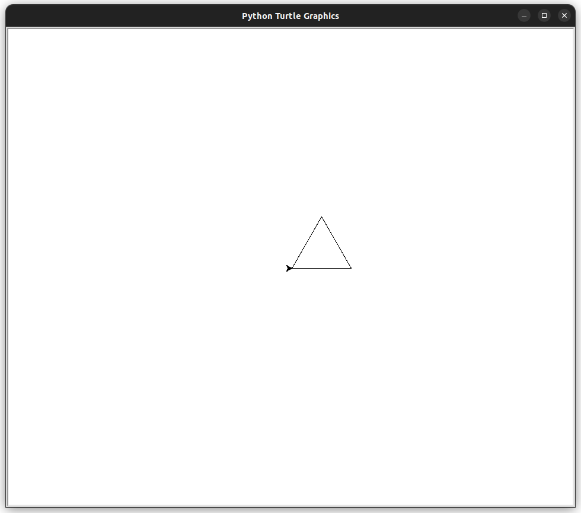
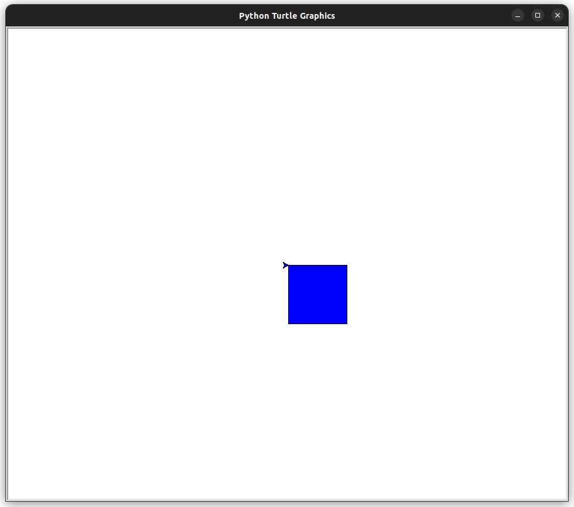

# Usando laços

Como vimos, laços são estruturas fundamentais na programação que permitem executar um bloco de código repetidamente. Neste contexto, vamos explorar como usar laços para criar desenhos de forma mais programática com o módulo Turtle em Python.


## Desenhando um Triângulo Equilátero

Para desenhar um triângulo equilátero com o Turtle, podemos utilizar um laço `for` para repetir as instruções de desenho. No exemplo a seguir, a tartaruga avança 100 unidades e vira 120 graus à esquerda, repetindo esse processo três vezes para formar o triângulo:

``` python
import turtle

# Cria uma nova janela do Turtle
janela = turtle.Screen()

# Cria uma nova tartaruga
tartaruga = turtle.Turtle()

# Desenha um triângulo equilátero
for _ in range(3):
    tartaruga.forward(100)
    tartaruga.left(120)

janela.mainloop()
```



## Desenhando um Quadrado Preenchido

Vamos agora criar um exemplo de desenho de um quadrado preenchido com a cor azul. Utilizaremos um laço `for` para desenhar os quatro lados do quadrado e preencher a forma com a cor azul:

``` python
import turtle

# Cria uma nova janela do Turtle
janela = turtle.Screen()

# Cria uma nova tartaruga
tartaruga = turtle.Turtle()

# Define a cor de preenchimento da tartaruga como azul
tartaruga.fillcolor("blue")

# Inicia o preenchimento da forma
tartaruga.begin_fill()

# Desenha um quadrado preenchido com lados de 100 pixels
for _ in range(4):
    tartaruga.forward(100)
    tartaruga.right(90)

# Termina o preenchimento da forma
tartaruga.end_fill()

janela.mainloop()
```
Neste exemplo, a tartaruga desenha um quadrado preenchido com a cor azul e lados de comprimento 100 unidades.



## Desenhando um Círculo com While

Agora, vamos explorar como desenhar um círculo utilizando um laço `while`. No exemplo a seguir, a tartaruga avança uma pequena distância e gira um ângulo específico repetidamente até completar um círculo:

``` python
import turtle

# Cria uma nova janela do Turtle
janela = turtle.Screen()

# Cria uma nova tartaruga
tartaruga = turtle.Turtle()

# Define o raio do círculo
raio = 100

# Define o ângulo de rotação para simular um círculo
angulo = 1

# Desenha um círculo
while True:
    tartaruga.forward(angulo)
    tartaruga.right(angulo)
    if abs(tartaruga.pos()) < 1:
        break

janela.mainloop()
```

Neste exemplo, a tartaruga desenha um círculo com raio de 100 unidades utilizando um laço `while`. A linha 8 define o ângulo (angulo) de rotação da tartaruga, que é utilizado para simular a forma circular.

O loop while True nas linhas 11 a 15 é responsável por desenhar o círculo. O loop funciona da seguinte maneira:

- `tartaruga.forward(angulo)`: Move a tartaruga para frente na direção atual por angulo unidades.
- `tartaruga.right(angulo)`: Rotaciona a tartaruga para a direita em angulo graus.
- `if abs(tartaruga.pos()) < 1`: Este condicional verifica se a distância da tartaruga da origem (0, 0) é menor que 1. Se for, significa que a tartaruga está próxima ao ponto de partida e o loop termina.
