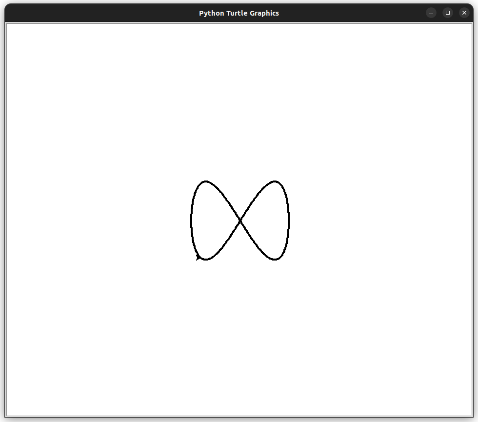
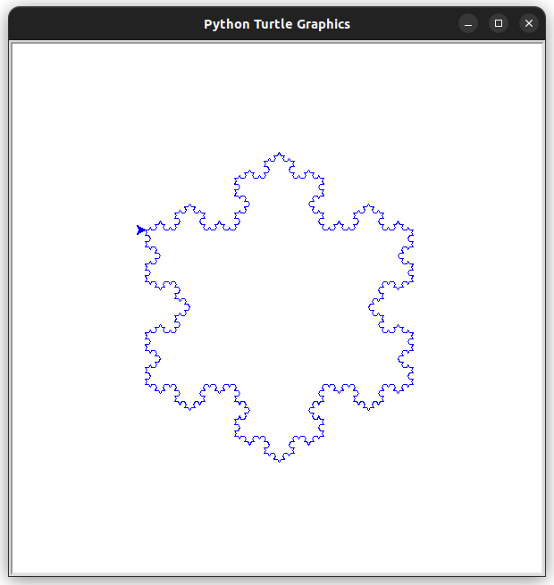

# Desenhando com Turtle

O pacote 'turtle' é uma biblioteca gráfica para Python que permite criar desenhos e animações de forma simples e intuitiva. Ele é amplamente utilizado para ensinar programação para iniciantes, mas também pode ser usado para criar gráficos e animações mais complexas.

## 1. Desenhando uma Espiral

Uma espiral é uma curva que se enrola em torno de um ponto central. Para desenhar uma espiral quadriculada com o pacote 'turtle', podemos usar o seguinte código:

``` python
import turtle

cursor = turtle.Turtle()
# define a velocidade do cursor
cursor.speed(0)

# Loop para desenhar a espiral quadriculada
for i in range(100):
    cursor.forward(5 + i * 5)  # a cada passo, o comprimento aumenta
    cursor.right(90)
# mantém a janela aberta
turtle.done()
```

Podemos também desenhar uma espiral circular, que pode ser pensafa como uma circuferência cujo raio aumenta constantemente. Para isso, usamos a função `turtle.Turtle().circle()`.

``` python
import turtle

cursor = turtle.Turtle()
# define a velocidade do cursor
cursor.speed(0)

# Loop para desenhar a espiral quadriculada
for i in range(100):
    cursor.circle(5 + i * 5, 90)  # desenha uma seção de circunferência de 10 graus
# mantém a janela aberta
turtle.done()
```


## 2. Criando uma Função para Desenhar as Figuras de Lissajous

As figuras de Lissajous são curvas paramétricas que são criadas pela combinação de dois movimentos harmônicos simples. No exemplo a seguir, usamos a função `math.sin()` para calcular as coordenadas x e y com base em um ângulo que varia de 0 a 1800 graus (ou seja, 5 voltas completas). A relação entre os períodos dos movimentos harmônicos é controlada pelo parâmetro delta.

``` python
import turtle
import math

def lissajous(a, b, delta):
    cursor = turtle.Turtle()
    cursor.speed(0)

    for theta in range(0, 360*5):
        x = a * math.sin(math.radians(theta))
        y = b * math.sin(math.radians(theta*delta))
        cursor.goto(x, y)

    turtle.done()

lissajous(100, 80, 2)
```



Neste código, a e b são os raios dos movimentos harmônicos nas direções x e y, respectivamente, e delta é a diferença de fase entre eles.

## 3. Criando uma Função para Desenhar Fractais

Os fractais são estruturas geométricas que apresentam auto-similaridade em diferentes escalas. Isso significa que, se você ampliar uma parte do fractal, verá uma forma que é semelhante à forma completa. Um exemplo famoso de um fractal é o floco de neve de Koch. Neste exemplo, usamos a recursão para desenhar cada lado do floco de neve.

``` python
import turtle

def koch_snowflake(cursor, order, size):
    if order == 0:
        cursor.forward(size)
    else:
        for angle in [60, -120, 60, 0]:
            koch_snowflake(cursor, order-1, size/3)
            cursor.left(angle)

def fractal_snowflake():
    screen = turtle.Screen()
    screen.setup(width=600, height=600)
    screen.bgcolor("white")

    pen = turtle.Turtle()
    pen.speed(0)
    pen.color("blue")

    pen.penup()
    pen.goto(-150, 90)
    pen.pendown()

    # Draw three Koch curves to make the snowflake
    for _ in range(3):
        koch_snowflake(pen, 4, 300)
        pen.right(120)

    screen.mainloop()
```



Neste código, order é a profundidade da recursão, ou seja, o número de vezes que a função koch_snowflake() chama a si mesma. size é o comprimento de cada segmento da curva de Koch. A cada nível de recursão, cada segmento da curva é dividido em quatro segmentos menores, cada um com um terço do comprimento do segmento original. A forma final é obtida após order níveis de recursão. A função fractal_snowflake() cria a janela e o cursor, e desenha três curvas de Koch para formar o floco de neve.
